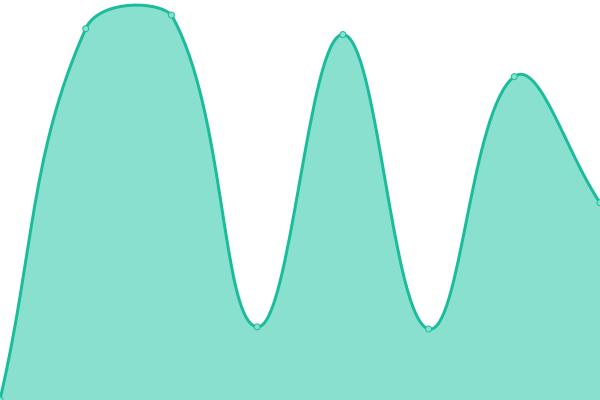
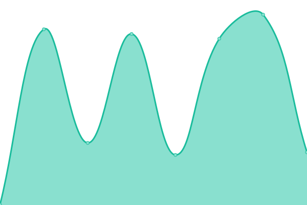

# [📈 Live Status](https://nacionvirtualchile.github.io/WebMonitor): <!--live status--> **🟩 All systems operational**

This repository contains the open-source uptime monitor and status page for [Sergio Villarroel](nacionvirtual.cl), powered by [Upptime](https://github.com/upptime/upptime).

With [Upptime](https://upptime.js.org), you can get your own unlimited and free uptime monitor and status page, powered entirely by a GitHub repository. We use [Issues](https://github.com/nacionvirtualchile/WebMonitor/issues) as incident reports, [Actions](https://github.com/nacionvirtualchile/WebMonitor/actions) as uptime monitors, and [Pages](https://nacionvirtualchile.github.io/WebMonitor) for the status page.

<!--start: status pages-->
<!-- This summary is generated by Upptime (https://github.com/upptime/upptime) -->
<!-- Do not edit this manually, your changes will be overwritten -->
<!-- prettier-ignore -->
| URL | Status | History | Response Time | Uptime |
| --- | ------ | ------- | ------------- | ------ |
|  [NacionVirtual](https://www.nacionvirtual.cl) | 🟩 Up | [nacion-virtual.yml](https://github.com/nacionvirtualchile/WebMonitor/commits/HEAD/history/nacion-virtual.yml) | 

 3821ms
     
 | 

<a href="https://nacionvirtualchile.github.io/webmonitor/history/nacion-virtual">98.01%</a>
    

|  [FMN](https://www.fmn.cl) | 🟩 Up | [fmn.yml](https://github.com/nacionvirtualchile/WebMonitor/commits/HEAD/history/fmn.yml) | 

 1290ms
     
 | 

<a href="https://nacionvirtualchile.github.io/webmonitor/history/fmn">97.61%</a>
    

|  [Parapenteantofagasta](https://parapenteantofagasta.cl) | 🟩 Up | [parapenteantofagasta.yml](https://github.com/nacionvirtualchile/WebMonitor/commits/HEAD/history/parapenteantofagasta.yml) | 

 3212ms
     
 | 

<a href="https://nacionvirtualchile.github.io/webmonitor/history/parapenteantofagasta">98.02%</a>
    

|  [Ecoshower](https://ecoshower.cl) | 🟩 Up | [ecoshower.yml](https://github.com/nacionvirtualchile/WebMonitor/commits/HEAD/history/ecoshower.yml) | 

 9910ms
     
 | 

<a href="https://nacionvirtualchile.github.io/webmonitor/history/ecoshower">92.91%</a>
    

<!--end: status pages-->

[**Visit our status website →**](https://nacionvirtualchile.github.io/WebMonitor)

## 📄 License

- Powered by: [Upptime](https://github.com/upptime/upptime)
- Code: [MIT](./LICENSE) © [Sergio Villarroel](nacionvirtual.cl)
- Data in the `./history` directory: [Open Database License](https://opendatacommons.org/licenses/odbl/1-0/)
